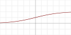
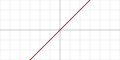
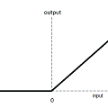
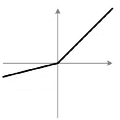
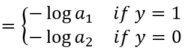
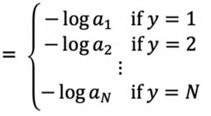

# TensorFlow

```python
import tensorflow as tf
```

| Description | Code |
|:-:|:-:|
| Model summary | `model.summary()` |
| Compile | `model.compile()` |
| Train | `model.fit(x, y, epochs=1)` |
| Predict | `model.predict(x_new)` |
| Get Model Weights | `model.get_weights()` |
| Get a layer with its name | `layer = model.get_layer(layer_name_string)` |
| Get all the model layers | `[layer1, ..., layerN] = model.layers` |
| Get a layer's weights | `w, b = layer.get_weights()` |
| Set a layer's weights | `layer.set_weights([w_new, b_new])` |

**examples:**

1) get the 3rd layer of model: `model.layers[2]`.

## General Format

```python
from tf.keras import Sequential

model = Sequential(
    [
        # Layer_1,
        # Layer_2,
        # ...
        # Layer_N
    ]
)

model.compile(optimizer=OPT, loss=LOSS)
model.fit(X_train, y_trian, epochs=500)
print(model.predict(x))
```

The `model.compile` statement defines a **loss function** and specifies a **compile optimization**.

## 1 Layers
Layers can have name (Optional) and is specified by `name` parameter of layer.

```python
from tf.keras.layers import Input, Dense, Normalization, Activation
```

1. **Input**: Specifies the expected shape of the input (suppose we have `n` features)
    ```python
    layer = Input(shape=(n,), layer='imadog')
    ```

2. **Dense**: creating a hidden layer with `k` neurons, activation function `ACT`, and regularid with $\lambda=$ `r`.

    ```python
    from tf.keras.regularizers import l2 as L2
    layer = Dense(units=k, activation=ACT, kernel_regularizer=L2(r), name='miaw')
    output_y = layer(input_x)
    ```

3. **Normalization**: Fitting the weights to the data will proceed more quickly if the data is normalized. This procedure makes sure features in the data are each normalized to have a similar range.
    ```python
    norm_layer = Normalization(axis=-1)
    # X is the input features. not only one feature.
    norm_layer.adapt(X)  # learns mean, variance
    Xn = norm_layer(X)   # Normalized features
    ```

4. **Activation**: Applies an activation function `ACT` to an output.
    ```python
    act_layer = Activation(activation=ACT)
    ```

## 2 Activation Functions

`relu` is widely used for hidden layers. but for the ouput layer there are different choices:

| Activation | Plot | Range | ACT | Formula | Description |
|:-:|:-:|:-:|:-:|:-:|:-:|
| Sigmoid (Logistic) |  | (0, 1) | `'sigmoid'` | $ g(z) = {1 \over 1 + e^{-z}} $ | Binary Classification |
| SoftMax |  | (0, 1) | `'softmax'` | $g(z)_i = {e^{z_i} \over \sum_{j=1}^{K} e^{z_j}}$ | Multi Classification |
| Linear |  | (-inf, inf) | `'linear'` | $ g(z) = z $ | Regression |
| ReLU |  | (0, inf) | `'relu'` |  $ g(z) = max(0, z) $ | Positive Regression |
| LeakyReLU |  | (-inf, inf) | `'leakyrelu'` | $ g(z) = max(\alpha z, z)$ | 


**Example:**
```python
# method 1
model.add(Dense(64, activation='relu'))

# method 2
model.add(Dense(64))
model.add(Activation('relu'))

# method 3
from tf.keras import activations
model.add(Dense(64, activation=activations.relu))
```

## 3 Loss Functions

$$ Cost ={1 \over m}\sum_{i=1}^mLoss(f(x^{(i)}), y^{(i)}) $$

$ y^{(i)} $ is the target value and $ f(x^{(i)}) $ or $ a $ is the neural network prediction (output of last activation function).

```python
from tf.keras.losses import MeanSquaredError, BinaryCrossentropy
```

| Loss Function Name | Tensorflow code | Formula | Category |
|:-:|:-:|:-:|:-:|
| Mean Squared Error (MSE) | `MeanSquaredError`, `mse` | $ {1 \over 2} \times{(y - f(x)})^ 2$ | Regression |
| Logistic Loss | `BinaryCrossentropy` |  | Binary Classification |
| SoftMax Loss | `SparseCategoricalCrossentropy` |  | Multiclassification |

**example:** we use `from_logits=True` for more computation accuracy. with this change, we need to set the activation function of last layer to `linear`.
```python
LOSS = BinaryCrossentropy(from_logits=True)
```


## 4 Optimization Methods

Gradient Descent is the default optimizer.

```python
from tf.keras.optimizers import Adam
```

- **Adam**: same as GD with some differences. Learning rate will be adjusted during the training to speed up the learning process. also each parameter will have their own learning rate. In action ADAM optimizer is better than GD optimizer.

    ```python
    OPT = Adam(learning_rate=0.01)
    ```